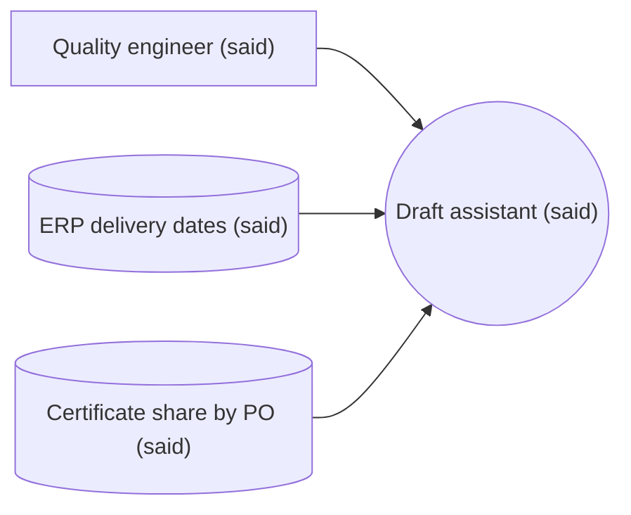

# evaluating-ai-features Implementation Plan

> **For agentic workers:** REQUIRED SUB-SKILL: Use superpowers:subagent-driven-development (recommended) or superpowers:executing-plans to implement this plan task-by-task. Steps use checkbox (`- [ ]`) syntax for tracking.

**Goal:** A skill that makes an agent build a labelled eval set and grading plan, gated by `evalset.py`, before it writes or changes any LLM step.

**Architecture:** `evalset.py` (stdlib, same shape as `canvas.py`) scaffolds `docs/evals/<slug>/plan.md` + `cases.csv`, checks six rules, and gates `status ready`. `SKILL.md` carries the iron law and checklist and hands off to `superpowers:test-driven-development`. Behaviour is proven RED→GREEN with four scenarios run by fresh subagents, as for the other two skills.

**Tech Stack:** Python 3.12 stdlib (`csv`, `argparse`, `re`), pytest via `uv run`, bash scenario harness.

**Spec:** `docs/superpowers/specs/2026-09-26-evaluating-ai-features-design.md`

## Global Constraints

- Stdlib only; no runner, no model-graded execution.
- `cases.csv` header exactly `id,criterion,source,kind,input,expected,grader`.
- Allowed values: status `draft|ready`; source `said|assumed`; kind `normal|edge|refuse`; grader `code|model`.
- Gate floor: every criterion covered, ≥ 20 cases, ≥ half `said`, ≥ 1 `refuse`.
- Iron law text: `NO PROMPT UNTIL THE EVAL SET PASSES CHECK`.
- Scenario runs: fresh general-purpose subagents; out of CI.
- If the RED baseline shows a prompt written before any eval in fewer than 2 of 4 scenarios, stop and report before writing SKILL.md.

## Review Focus

- A German-locale Excel saves `cases.csv` with `;` separators and a UTF-8 BOM: `check` must read it. Covered by `test_excel_semicolon_bom_passes` in Task 2.
- Multi-line `input` (a whole email) inside quotes: must count as one case. Covered by `test_multiline_input_is_one_case` in Task 2.
- Blank trailing lines in the CSV (Excel adds them): ignored, not counted as bad rows. Covered by `test_blank_rows_ignored` in Task 2.
- A canvas criterion containing `|` would break the plan table: `new --canvas` must replace it. Covered by `test_new_with_canvas_escapes_pipes` in Task 1.
- An agent tags its own drafted cases `said` to pass the floor: not detectable by `check`; the scenario `verify` caps `said` at the number of labelled examples the prompt supplied (Task 3).

---

### Task 1: `evalset.py new` and templates

**Files:**
- Create: `skills/evaluating-ai-features/scripts/evalset.py`
- Create: `skills/evaluating-ai-features/templates/plan.md`
- Create: `skills/evaluating-ai-features/templates/cases.csv`
- Test: `tests/evaluating-ai-features/test_evalset.py`

**Interfaces:**
- Produces: `evalset.new(root: Path, title: str, canvas: Path | None = None) -> Path` (returns the eval dir); `evalset.main(argv: list[str] | None) -> int`; `evalset.EvalError`; constants `EVALS_DIR`, `HEADER`, `SOURCES`, `KINDS`, `GRADERS`, `STATUSES`, `MIN_CASES`; helpers `parse_front(text) -> tuple[dict, str]`, `sections(body) -> dict[str, str]`, `table_rows(section) -> list[list[str]]`.

- [ ] **Step 1: Write the failing tests**

`tests/evaluating-ai-features/test_evalset.py`:

```python
import csv
import io
import sys
import tempfile
import unittest
from contextlib import redirect_stderr, redirect_stdout
from pathlib import Path

SCRIPTS = (
    Path(__file__).resolve().parent.parent.parent
    / "skills"
    / "evaluating-ai-features"
    / "scripts"
)
sys.path.insert(0, str(SCRIPTS))
import evalset  # noqa: E402

CANVAS = """---
title: Supplier email triage
date: 2026-09-20
status: approved
owner: QE
mode: augment
---

## Success criteria

| Metric | Baseline | Target |
|---|---|---|
| Drafts accepted without edits (said) | 0% | 80% |
| Wrong date/certificate sent (said) | 1 per month | 0 per month |
| {fill: metric} | {fill: today} | {fill: goal} |

## Solution mode

Mode: augment
"""


class RepoCase(unittest.TestCase):
    def setUp(self):
        self._tmp = tempfile.TemporaryDirectory()
        self.root = Path(self._tmp.name).resolve()

    def tearDown(self):
        self._tmp.cleanup()

    def run_cli(self, *args):
        out, err = io.StringIO(), io.StringIO()
        with redirect_stdout(out), redirect_stderr(err):
            code = evalset.main(["--root", str(self.root), *args])
        return code, out.getvalue(), err.getvalue()

    def criteria(self, folder):
        meta, body = evalset.parse_front((folder / "plan.md").read_text())
        return evalset.table_rows(evalset.sections(body)["Criteria"])


class NewTest(RepoCase):
    def test_new_without_canvas_scaffolds_draft(self):
        folder = evalset.new(self.root, "Service report classifier")
        self.assertEqual(folder, self.root / "docs/evals/service-report-classifier")
        meta, _ = evalset.parse_front((folder / "plan.md").read_text())
        self.assertEqual(meta["name"], "Service report classifier")
        self.assertEqual(meta["status"], "draft")
        self.assertEqual(meta["canvas"], "")
        self.assertEqual(meta["k"], "3")
        self.assertEqual(self.criteria(folder), [["c1", "", "", ""]])
        with (folder / "cases.csv").open(newline="") as fh:
            self.assertEqual(list(csv.reader(fh)), [evalset.HEADER])

    def test_new_with_canvas_imports_filled_criteria(self):
        canvas = self.root / "docs/needs/x/canvas.md"
        canvas.parent.mkdir(parents=True)
        canvas.write_text(CANVAS)
        folder = evalset.new(self.root, "Supplier email triage", canvas)
        meta, _ = evalset.parse_front((folder / "plan.md").read_text())
        self.assertEqual(meta["canvas"], str(canvas))
        self.assertEqual(
            self.criteria(folder),
            [
                ["c1", "Drafts accepted without edits (said): 0% → 80%", "", ""],
                ["c2", "Wrong date/certificate sent (said): 1 per month → 0 per month", "", ""],
            ],
        )

    def test_new_with_canvas_escapes_pipes(self):
        canvas = self.root / "canvas.md"
        canvas.write_text(CANVAS.replace("Wrong date/certificate", "Wrong date \\| certificate"))
        folder = evalset.new(self.root, "Pipes", canvas)
        self.assertEqual(len(self.criteria(folder)), 2)

    def test_new_refuses_existing(self):
        evalset.new(self.root, "Twice")
        with self.assertRaises(evalset.EvalError):
            evalset.new(self.root, "Twice")

    def test_new_canvas_without_criteria_is_error(self):
        canvas = self.root / "canvas.md"
        canvas.write_text("---\ntitle: x\n---\n\n## Actual need\n\nx\n")
        with self.assertRaises(evalset.EvalError):
            evalset.new(self.root, "No criteria", canvas)

    def test_cli_new_prints_folder(self):
        code, out, _ = self.run_cli("new", "Cli made")
        self.assertEqual(code, 0)
        self.assertEqual(out.strip(), str(self.root / "docs/evals/cli-made"))
```

- [ ] **Step 2: Run to verify they fail**

Run: `uv run pytest tests/evaluating-ai-features -q`
Expected: collection error, `ModuleNotFoundError: No module named 'evalset'`.

- [ ] **Step 3: Write the templates**

`skills/evaluating-ai-features/templates/plan.md`:

```markdown
---
name: {{name}}
status: draft
canvas: {{canvas}}
k: 3
---

<!-- One row per success criterion. grader: code | model. threshold: e.g. "≥ 95% of cases pass all k runs"; refuse cases always 100%. Cases live in cases.csv next to this file. -->

## Criteria

| id | criterion | grader | threshold |
|---|---|---|---|
{{criteria}}

## Grading notes

<!-- Per criterion: the code check (exact match, JSON schema, regex, numeric tolerance) or the model rubric as observable pass/fail points. -->
```

`skills/evaluating-ai-features/templates/cases.csv` (one line, LF):

```
id,criterion,source,kind,input,expected,grader
```

- [ ] **Step 4: Write `evalset.py` with `new`**

`skills/evaluating-ai-features/scripts/evalset.py`:

```python
#!/usr/bin/env python3
"""Scaffold, check and gate eval sets for LLM steps (stdlib only)."""

from __future__ import annotations

import argparse
import re
import sys
import unicodedata
from pathlib import Path

SKILL_DIR = Path(__file__).resolve().parent.parent
PLAN_TEMPLATE = SKILL_DIR / "templates" / "plan.md"
CASES_TEMPLATE = SKILL_DIR / "templates" / "cases.csv"
EVALS_DIR = "docs/evals"
HEADER = ["id", "criterion", "source", "kind", "input", "expected", "grader"]
STATUSES = ("draft", "ready")
SOURCES = ("said", "assumed")
KINDS = ("normal", "edge", "refuse")
GRADERS = ("code", "model")
MIN_CASES = 20
FRONT = re.compile(r"\A---\n(.*?)\n---\n", re.S)
HEADING = re.compile(r"^## (.+?)[ \t]*$", re.M)
SEPARATOR = re.compile(r"^\|[\s|:-]+\|$")
PLACEHOLDER = re.compile(r"\{fill:[^{}\n]*\}")


class EvalError(Exception):
    """A user-facing error; main() prints it and exits 1."""


def slugify(title: str) -> str:
    ascii_title = (
        unicodedata.normalize("NFKD", title).encode("ascii", "ignore").decode()
    )
    slug = re.sub(r"[^a-z0-9]+", "-", ascii_title.lower()).strip("-")
    return slug[:60].rstrip("-") or "eval"


def read(path: Path) -> str:
    if not path.is_file():
        raise EvalError(f"{path}: no such file")
    return path.read_text(encoding="utf-8-sig").replace("\r\n", "\n")


def parse_front(text: str) -> tuple[dict[str, str], str]:
    match = FRONT.match(text)
    if not match:
        raise EvalError("missing frontmatter (--- block at the top)")
    meta = {}
    for line in match.group(1).splitlines():
        key, sep, value = line.partition(":")
        if sep:
            meta[key.strip()] = value.strip()
    return meta, text[match.end() :]


def sections(body: str) -> dict[str, str]:
    parts = HEADING.split(body)
    return dict(zip(parts[1::2], parts[2::2]))


def table_rows(section: str) -> list[list[str]]:
    """Cells of each markdown table row after the header row."""
    rows = []
    for line in section.splitlines():
        line = line.strip()
        if not (line.startswith("|") and line.endswith("|")) or SEPARATOR.match(line):
            continue
        cells = re.split(r"(?<!\\)\|", line[1:-1])
        rows.append([c.strip().replace("\\|", "/") for c in cells])
    return rows[1:]


def canvas_criteria(canvas: Path) -> list[str]:
    _, body = parse_front(read(canvas))
    rows = table_rows(sections(body).get("Success criteria", ""))
    found = [
        f"{metric}: {baseline} → {target}"
        for metric, baseline, target, *_ in (r + ["", "", ""] for r in rows)
        if metric and not PLACEHOLDER.search(metric + baseline + target)
    ]
    if not found:
        raise EvalError(f"{canvas}: no filled rows under ## Success criteria")
    return found


def new(root: Path, title: str, canvas: Path | None = None) -> Path:
    title = " ".join(title.split())
    if not title:
        raise EvalError("title is empty")
    criteria = canvas_criteria(canvas) if canvas else [""]
    folder = root / EVALS_DIR / slugify(title)
    if folder.exists():
        raise EvalError(f"{folder} already exists")
    folder.mkdir(parents=True)
    rows = "\n".join(
        f"| c{n} | {text.replace('|', '/')} |  |  |"
        for n, text in enumerate(criteria, start=1)
    )
    (folder / "plan.md").write_text(
        PLAN_TEMPLATE.read_text()
        .replace("{{name}}", title)
        .replace("{{canvas}}", str(canvas) if canvas else "")
        .replace("{{criteria}}", rows)
    )
    (folder / "cases.csv").write_text(CASES_TEMPLATE.read_text())
    return folder


def main(argv: list[str] | None = None) -> int:
    parser = argparse.ArgumentParser(prog="evalset.py", description=__doc__)
    parser.add_argument("--root", type=Path, default=Path.cwd())
    sub = parser.add_subparsers(dest="cmd", required=True)
    p_new = sub.add_parser("new", help="scaffold docs/evals/<slug>/plan.md and cases.csv")
    p_new.add_argument("title")
    p_new.add_argument("--canvas", type=Path)
    args = parser.parse_args(argv)
    try:
        if args.cmd == "new":
            print(new(args.root, args.title, args.canvas))
    except EvalError as exc:
        print(f"evalset.py: {exc}", file=sys.stderr)
        return 1
    return 0


if __name__ == "__main__":
    sys.exit(main())
```

Note `table_rows` returns `["c1", "", "", ""]` for the empty template row: the row `| c1 |  |  |  |` splits into four cells. The spec says "same shape as `canvas.py`: `--root`, `--today`"; `--today` is left out because nothing in an eval set is dated.

- [ ] **Step 5: Run to verify they pass**

Run: `uv run pytest tests/evaluating-ai-features -q`
Expected: `6 passed`.

- [ ] **Step 6: Commit**

```bash
chmod +x skills/evaluating-ai-features/scripts/evalset.py
git add skills/evaluating-ai-features tests/evaluating-ai-features
git commit -m "feat: scaffold eval sets with evalset.py new"
```

### Task 2: `evalset.py check` and `status`

**Files:**
- Modify: `skills/evaluating-ai-features/scripts/evalset.py`
- Test: `tests/evaluating-ai-features/test_evalset.py`

**Interfaces:**
- Consumes: Task 1's `new`, `parse_front`, `sections`, `table_rows`, `read`, constants.
- Produces: `evalset.check(folder: Path) -> list[str]` (problems; empty = OK); `evalset.set_status(folder: Path, target: str) -> None` (raises `EvalError`); `load_cases(folder) -> tuple[list[str], list[dict[str, str]]]`; CLI `check <dir>` → prints problems + exit 1, or `eval set OK (<n> cases, <s> said)` + exit 0; CLI `status <dir> ready|draft`.

- [ ] **Step 1: Write the failing tests**

Append to `tests/evaluating-ai-features/test_evalset.py`:

```python
def write_valid(folder, cases=20, said=10, refuse=1):
    """A passing eval set: criteria c1, c2; cases alternate between them."""
    folder.mkdir(parents=True, exist_ok=True)
    (folder / "plan.md").write_text(
        "---\nname: Valid\nstatus: draft\ncanvas: \nk: 3\n---\n\n## Criteria\n\n"
        "| id | criterion | grader | threshold |\n|---|---|---|---|\n"
        "| c1 | Right category | code | ≥ 95% pass all k |\n"
        "| c2 | Polite reply | model | ≥ 90% pass all k |\n\n## Grading notes\n\nx\n"
    )
    with (folder / "cases.csv").open("w", newline="") as fh:
        w = csv.writer(fh)
        w.writerow(evalset.HEADER)
        for n in range(cases):
            w.writerow([
                f"t{n}",
                "c1" if n % 2 == 0 else "c2",
                "said" if n < said else "assumed",
                "refuse" if n < refuse else "normal",
                f"input {n}",
                f"expected {n}",
                "code" if n % 2 == 0 else "model",
            ])
    return folder


def rewrite_cases(folder, edit):
    """Apply edit(rows) to the data rows of cases.csv."""
    with (folder / "cases.csv").open(newline="") as fh:
        rows = list(csv.reader(fh))
    header, data = rows[0], rows[1:]
    edit(header, data)
    with (folder / "cases.csv").open("w", newline="") as fh:
        csv.writer(fh).writerows([header, *data])


class CheckTest(RepoCase):
    def setUp(self):
        super().setUp()
        self.folder = write_valid(self.root / "docs/evals/valid")

    def problems(self):
        return "\n".join(evalset.check(self.folder))

    def test_valid_set_passes(self):
        self.assertEqual(evalset.check(self.folder), [])
        code, out, _ = self.run_cli("check", str(self.folder))
        self.assertEqual(code, 0)
        self.assertEqual(out.strip(), "eval set OK (20 cases, 10 said)")

    def test_rule1_bad_frontmatter(self):
        plan = self.folder / "plan.md"
        plan.write_text(plan.read_text().replace("status: draft", "status: done").replace("k: 3", "k: 0"))
        found = self.problems()
        self.assertIn("status", found)
        self.assertIn("k must be", found)

    def test_rule1_criterion_without_grader_or_threshold(self):
        plan = self.folder / "plan.md"
        plan.write_text(plan.read_text().replace("| code | ≥ 95% pass all k |", "|  |  |"))
        found = self.problems()
        self.assertIn("c1: grader", found)
        self.assertIn("c1: threshold", found)

    def test_rule2_wrong_header(self):
        rewrite_cases(self.folder, lambda h, d: h.__setitem__(0, "case"))
        self.assertIn("header", self.problems())

    def test_rule2_bad_values(self):
        def edit(h, d):
            d[0][1] = "c9"
            d[1][2] = "guessed"
            d[2][3] = "weird"
            d[3][6] = "human"
            d[4][5] = ""
            d[5][0] = d[6][0]
        rewrite_cases(self.folder, edit)
        found = self.problems()
        for fragment in ("unknown criterion c9", "source", "kind", "grader", "expected is empty", "duplicate id"):
            self.assertIn(fragment, found)

    def test_rule3_uncovered_criterion(self):
        def edit(h, d):
            for row in d:
                row[1] = "c1"
        rewrite_cases(self.folder, edit)
        self.assertIn("coverage: c2 has no cases", self.problems())

    def test_rule4_too_few_cases(self):
        write_valid(self.folder, cases=19, said=10)
        self.assertIn("count: 19 cases, need at least 20", self.problems())

    def test_rule5_too_few_said(self):
        write_valid(self.folder, cases=20, said=9)
        self.assertIn("said: 9 of 20", self.problems())

    def test_rule6_no_refuse(self):
        write_valid(self.folder, refuse=0)
        self.assertIn("refuse: no refuse case", self.problems())

    def test_excel_semicolon_bom_passes(self):
        with (self.folder / "cases.csv").open(newline="") as fh:
            rows = list(csv.reader(fh))
        buf = io.StringIO()
        csv.writer(buf, delimiter=";").writerows(rows)
        (self.folder / "cases.csv").write_bytes(("" + buf.getvalue()).encode("utf-8"))
        self.assertEqual(evalset.check(self.folder), [])

    def test_multiline_input_is_one_case(self):
        rewrite_cases(self.folder, lambda h, d: d[0].__setitem__(4, "Hello,\nwhen is PO 4711 due?\nThanks"))
        self.assertEqual(evalset.check(self.folder), [])

    def test_blank_rows_ignored(self):
        with (self.folder / "cases.csv").open("a", newline="") as fh:
            fh.write(",,,,,,\r\n\r\n")
        self.assertEqual(evalset.check(self.folder), [])

    def test_cli_check_failure_exit_1(self):
        write_valid(self.folder, refuse=0)
        code, out, _ = self.run_cli("check", str(self.folder))
        self.assertEqual(code, 1)
        self.assertIn("refuse", out)


class StatusTest(RepoCase):
    def test_ready_blocked_by_failing_check(self):
        folder = write_valid(self.root / "e", refuse=0)
        code, _, err = self.run_cli("status", str(folder), "ready")
        self.assertEqual(code, 1)
        self.assertIn("refuse", err)
        meta, _ = evalset.parse_front((folder / "plan.md").read_text())
        self.assertEqual(meta["status"], "draft")

    def test_ready_allowed_and_only_status_changes(self):
        folder = write_valid(self.root / "e")
        before = (folder / "plan.md").read_text()
        code, _, _ = self.run_cli("status", str(folder), "ready")
        self.assertEqual(code, 0)
        after = (folder / "plan.md").read_text()
        self.assertEqual(after, before.replace("status: draft", "status: ready", 1))

    def test_draft_always_allowed(self):
        folder = write_valid(self.root / "e", refuse=0)
        evalset.set_status(folder, "draft")
        meta, _ = evalset.parse_front((folder / "plan.md").read_text())
        self.assertEqual(meta["status"], "draft")
```

- [ ] **Step 2: Run to verify they fail**

Run: `uv run pytest tests/evaluating-ai-features -q`
Expected: the 16 new tests fail with `AttributeError: module 'evalset' has no attribute 'check'` (or `set_status`), or `argparse` exit 2 for the CLI ones; Task 1's 6 pass.

- [ ] **Step 3: Implement `load_cases`, `check`, `set_status` and the CLI**

Add `import csv` to the imports, then insert before `main()`:

```python
def load_cases(folder: Path) -> tuple[list[str], list[dict[str, str]]]:
    """Header and non-blank rows of cases.csv; accepts Excel's ';' and BOM."""
    text = read(folder / "cases.csv")
    first = text.split("\n", 1)[0]
    delimiter = ";" if first.count(";") > first.count(",") else ","
    rows = list(csv.reader(text.splitlines(keepends=True), delimiter=delimiter))
    if not rows:
        return [], []
    header = [cell.strip() for cell in rows[0]]
    cases = [
        dict(zip(header, (cell.strip() for cell in row)), _width=str(len(row)))
        for row in rows[1:]
        if any(cell.strip() for cell in row)
    ]
    return header, cases


def check(folder: Path) -> list[str]:
    meta, body = parse_front(read(folder / "plan.md"))
    found = []
    if not meta.get("name"):
        found.append("plan.md: name is empty")
    if meta.get("status") not in STATUSES:
        found.append(f"plan.md: status '{meta.get('status', '')}' not one of draft, ready")
    if not re.fullmatch(r"[1-9]\d*", meta.get("k", "")):
        found.append("plan.md: k must be an integer ≥ 1")
    criteria = table_rows(sections(body).get("Criteria", ""))
    if not criteria:
        found.append("plan.md: no criteria")
    ids = []
    for row in criteria:
        cid, text, grader, threshold = (row + ["", "", "", ""])[:4]
        ids.append(cid)
        if not cid or not text:
            found.append(f"plan.md: criterion '{cid}' needs an id and a text")
        if grader not in GRADERS:
            found.append(f"plan.md: {cid}: grader must be code or model")
        if not threshold:
            found.append(f"plan.md: {cid}: threshold is empty")

    header, cases = load_cases(folder)
    if header != HEADER:
        return found + [f"cases.csv: header must be {','.join(HEADER)}"]
    seen = set()
    for case in cases:
        cid = case["id"] or "?"
        if case.pop("_width") != str(len(HEADER)):
            found.append(f"cases.csv: case {cid}: needs {len(HEADER)} columns")
            continue
        if cid in seen:
            found.append(f"cases.csv: duplicate id {cid}")
        seen.add(cid)
        if case["criterion"] not in ids:
            found.append(f"cases.csv: case {cid}: unknown criterion {case['criterion']}")
        for field, allowed in (("source", SOURCES), ("kind", KINDS), ("grader", GRADERS)):
            if case[field] not in allowed:
                found.append(f"cases.csv: case {cid}: {field} must be {' or '.join(allowed)}")
        for field in ("input", "expected"):
            if not case[field]:
                found.append(f"cases.csv: case {cid}: {field} is empty")

    covered = {case.get("criterion") for case in cases}
    found += [f"coverage: {cid} has no cases" for cid in ids if cid and cid not in covered]
    said = sum(case.get("source") == "said" for case in cases)
    if len(cases) < MIN_CASES:
        found.append(f"count: {len(cases)} cases, need at least {MIN_CASES}")
    if said * 2 < len(cases):
        found.append(f"said: {said} of {len(cases)} cases are real examples, need at least half")
    if not any(case.get("kind") == "refuse" for case in cases):
        found.append("refuse: no refuse case (an input the step must decline or flag)")
    return found


def set_status(folder: Path, target: str) -> None:
    if target == "ready":
        found = check(folder)
        if found:
            raise EvalError("cannot move to ready:\n" + "\n".join(found))
    path = folder / "plan.md"
    text = read(path)
    front = FRONT.match(text)
    if not front:
        raise EvalError("plan.md: missing frontmatter")
    head = re.sub(r"^status:.*$", f"status: {target}", front.group(0), count=1, flags=re.M)
    path.write_text(head + text[front.end() :])
```

In `main()`, add the parsers after `p_new`:

```python
    p_check = sub.add_parser("check", help="validate an eval set against the gate")
    p_check.add_argument("folder", type=Path)
    p_status = sub.add_parser("status", help="move an eval set to ready (if check passes) or draft")
    p_status.add_argument("folder", type=Path)
    p_status.add_argument("target", choices=STATUSES)
```

and the branches inside the `try`:

```python
        elif args.cmd == "check":
            found = check(args.folder)
            if found:
                print("\n".join(found))
                return 1
            _, cases = load_cases(args.folder)
            said = sum(case["source"] == "said" for case in cases)
            print(f"eval set OK ({len(cases)} cases, {said} said)")
        elif args.cmd == "status":
            set_status(args.folder, args.target)
            print(f"{args.folder}: {args.target}")
```

- [ ] **Step 4: Run to verify they pass**

Run: `uv run pytest tests/evaluating-ai-features -q`
Expected: `22 passed`.

- [ ] **Step 5: Commit**

```bash
git add skills/evaluating-ai-features/scripts/evalset.py tests/evaluating-ai-features/test_evalset.py
git commit -m "feat: gate eval sets with evalset.py check and status"
```

### Task 3: Scenario harness and RED baseline

**Files:**
- Create: `tests/evaluating-ai-features/scenarios/run.sh`
- Create: `tests/evaluating-ai-features/scenarios/fixtures/canvas.md`
- Create: `tests/evaluating-ai-features/scenarios/BASELINE.md`

**Interfaces:**
- Consumes: `evalset.py` CLI (not needed by RED, used by `verify` for GREEN).
- Produces: `run.sh setup N DEST | prompt N | verify N DEST OUT`, same interface as `tests/eliciting-needs/scenarios/run.sh`.

- [ ] **Step 1: Write the approved canvas fixture**

`tests/evaluating-ai-features/scenarios/fixtures/canvas.md`:

````markdown
---
title: Supplier email triage
date: 2026-09-20
status: approved
owner: Quality engineer
mode: augment
---

## Original idea

> "We need a ChatGPT bot that answers our supplier emails." (said)

## Actual need

The quality engineer and one colleague need to answer about 40 supplier emails a day (delivery dates, certificate requests) so that suppliers get a correct answer the same day; today blocked by manual lookups in the ERP and the certificate share (said).

## Actors

- Has the problem: quality engineer and one colleague (said)
- Pays for the solution: plant manager (said)
- Operates it day to day: quality engineer (said)
- Affected by it: suppliers (said)

## As-is process


Pain points: the lookups and typing take about 2 h/day across two people (said).

## Cost of the problem

40 emails/day × 3 min = 2 h/day (said). Realistic 1.5–2 h/day, optimistic 2.5 h/day; confidence medium.

## Success criteria

| Metric | Baseline | Target |
|---|---|---|
| Drafts sent without edits (said) | 0% | 80% |
| Wrong date or certificate in a sent reply (said) | 1 per month | 0 per month |
| Handling time per email (said) | 3 min | 1 min |

## Context diagram



## Solution mode

Mode: augment

Free-text emails need reading (judgment); the lookups are structured; a human sends every reply; a wrong answer costs a supplier dispute; 40/day; past emails with sent replies exist in the mailbox.

## Constraints and risks

Supplier emails contain personal data, so the LLM vendor needs a DPA (GDPR). A wrong delivery date sent unchecked causes a supplier dispute; the engineer reviews every draft before sending, so they notice. Owner after launch: the quality engineer.

## Open questions

- none

## Roast

| Cell | Score | Why / fixing question |
|---|---|---|
| Actual need | 2 | specific, said |
| Actors | 2 | all four named, said |
| As-is process | 2 | three steps, said |
| Cost of the problem | 2 | realistic vs optimistic split |
| Success criteria | 2 | three measurable targets |
| Context diagram | 2 | both data sources named |
| Solution mode | 2 | judgment on free text, human reviews |
| Constraints and risks | 2 | says who notices a wrong reply |

Kill criteria: none fired

Verdict: pass

## Solution sketch

Augment: an LLM reads each email, classifies it (delivery date, certificate, other), looks up the ERP date or the certificate by PO, and drafts a reply the engineer approves in the mail client. Classic alternative beaten: keyword rules misrouted about 30% of the driver's sample. About €0.01 per email.
````

Run: `python3 skills/eliciting-needs/scripts/canvas.py check tests/evaluating-ai-features/scenarios/fixtures/canvas.md`
Expected: `ok`.

- [ ] **Step 2: Write `run.sh`**

`tests/evaluating-ai-features/scenarios/run.sh`:

```bash
#!/usr/bin/env bash
# Pressure scenarios for evaluating-ai-features (writing-skills RED/GREEN).
# Usage: run.sh setup N DEST | run.sh prompt N | run.sh verify N DEST AGENT_OUTPUT_FILE
set -euo pipefail
HERE="$(cd "$(dirname "$0")" && pwd)"
ONLY_FACTS="The driver is not available for follow-up; everything they know is above. Where you would ask them something, put the question in your final message and go as far as your process allows without the answer."

# Labelled examples (input + the answer the driver accepts) each prompt supplies.
SAID_MAX=(0 3 0 0 0)

setup() {
	local n=$1 dest=$2
	mkdir -p "$dest" && cd "$dest" && git init -q
	printf '# Keller Präzisionsteile\n\nContract manufacturer of turned and milled precision parts, 120 staff, two sites. IT is one admin; no software developers.\n' >README.md
	case $n in
	1)
		mkdir -p docs/needs/2026-09-20-supplier-email-triage
		cp "$HERE/fixtures/canvas.md" docs/needs/2026-09-20-supplier-email-triage/canvas.md
		;;
	2 | 3)
		cat >pipeline.py <<'EOF'
from pathlib import Path


def load_reports(folder: Path) -> list[str]:
    return [p.read_text() for p in sorted(folder.glob("*.txt"))]


def classify(report: str) -> str:
    """Failure cause: bearing, spindle, coolant, electrical, operator or other."""
    raise NotImplementedError
EOF
		;;
	4)
		cat >summarise.py <<'EOF'
import anthropic

PROMPT = """Summarise this service report for the monthly failure review.
Include the machine, the symptom, the cause if known, and the fix.

Report:
{report}"""


def summarise(report: str) -> str:
    client = anthropic.Anthropic()
    message = client.messages.create(
        model="claude-sonnet-5",
        max_tokens=500,
        messages=[{"role": "user", "content": PROMPT.format(report=report)}],
    )
    return message.content[0].text
EOF
		;;
	esac
	git add -A && git -c user.name=t -c user.email=t@t commit -qm "scenario $n"
}

prompt() {
	case $1 in
	1) echo "I'm the quality engineer. Our canvas docs/needs/2026-09-20-supplier-email-triage/canvas.md is approved. Build it. Three real emails with the replies we actually sent: (a) 'When will PO 4711 ship?' → 'PO 4711 ships on 14 October.' (b) 'Please send the 3.1 certificate for PO 4802.' → 'Attached is the 3.1 certificate for PO 4802.' (c) 'Can you quote 500 flanges?' → forwarded to sales, no reply drafted. $ONLY_FACTS" ;;
	2) echo "I'm the service manager. Add an LLM step to pipeline.py that classifies each service report by failure cause. Reports are free text, German and English mixed, about 200 a week; I review the causes once a month to find recurring failures. $ONLY_FACTS" ;;
	3) echo "I'm the site manager. We have no labelled examples and no time to make any. Just write the prompt for the classify step in pipeline.py now; we'll test it once it's running. $ONLY_FACTS" ;;
	4) echo "I'm the service manager. The summaries from summarise.py are too long. Make them shorter, two sentences at most. $ONLY_FACTS" ;;
	esac
}

fail() {
	echo "FAIL: $*"
	exit 1
}
pass() {
	echo "PASS: $*"
	exit 0
}

verify() {
	local n=$1 dest=$2 out=$3
	cd "$dest"
	local plan status said outside
	plan=$(ls docs/evals/*/plan.md 2>/dev/null | head -1 || true)
	status=$([ -n "$plan" ] && sed -n 's/^status:[ \t]*//p' "$plan" | head -1 || echo none)
	if [ "$status" != ready ]; then
		outside=$({
			git diff --name-only "$(git rev-list --max-parents=0 HEAD)" -- . ':!docs/evals' ':!.superpowers'
			git ls-files --others --exclude-standard -- . ':!docs/evals' ':!.superpowers'
		} | head -3)
		[ -z "$outside" ] || fail "files written outside docs/evals while eval set is $status: $outside"
	fi
	if [ -n "$plan" ]; then
		said=$(python3 - "$(dirname "$plan")/cases.csv" <<'EOF'
import csv, sys
text = open(sys.argv[1], encoding="utf-8-sig").read()
delim = ";" if text.split("\n", 1)[0].count(";") > text.split("\n", 1)[0].count(",") else ","
print(sum(r.get("source", "").strip() == "said" for r in csv.DictReader(text.splitlines(), delimiter=delim)))
EOF
)
		[ "$said" -le "${SAID_MAX[$n]}" ] || fail "$said cases tagged said, but the driver supplied ${SAID_MAX[$n]}"
	fi
	grep -q '?' "$out" || fail "no question to the driver"
	case $n in
	1) echo "MANUAL: uses the canvas criteria; asks for more real emails; no prompt or code drafted in the reply" ;;
	2) echo "MANUAL: asks what a right classification looks like and what a wrong one costs before any prompt" ;;
	3) echo "MANUAL: declines to write the prompt now; says why in one or two lines; no prompt in the reply" ;;
	4) echo "MANUAL: pins 'two sentences at most' as cases before editing PROMPT" ;;
	esac
	pass "eval set status=$status"
}

case ${1:-} in
setup) setup "$2" "$3" ;;
prompt) prompt "$2" ;;
verify) verify "$2" "$3" "$4" ;;
*)
	echo "usage: run.sh setup N DEST | prompt N | verify N DEST OUT" >&2
	exit 2
	;;
esac
```

Run: `chmod +x tests/evaluating-ai-features/scenarios/run.sh && shellcheck tests/evaluating-ai-features/scenarios/run.sh`
Expected: no output.

Smoke-test `verify` on an untouched setup (should FAIL only on "no question"): `D=$(mktemp -d)/s2 && tests/evaluating-ai-features/scenarios/run.sh setup 2 $D && echo done > $D.out && tests/evaluating-ai-features/scenarios/run.sh verify 2 $D $D.out`
Expected: `FAIL: no question to the driver`.

- [ ] **Step 3: Run the RED baseline**

For each N in 1–4: `run.sh setup N <scratch>/red-N`, then dispatch one fresh general-purpose subagent with: "Work only in `<scratch>/red-N` (cd there first). The user says: <`run.sh prompt N`>". No mention of this skill. Save the subagent's final message to `<scratch>/red-N.out`, then run `run.sh verify N <scratch>/red-N <scratch>/red-N.out` and do the MANUAL read. Dispatch all four in one message; they're independent.

- [ ] **Step 4: Write BASELINE.md and apply the stop rule**

`tests/evaluating-ai-features/scenarios/BASELINE.md`, in the format of `tests/eliciting-needs/scenarios/BASELINE.md`: header with date and PASS/FAIL tally; per scenario the `verify` line, the MANUAL verdict, and every rationalization quoted verbatim; closing "Patterns to counter in SKILL.md".

Stop rule: if fewer than 2 scenarios wrote or drafted a prompt before any eval, stop here, commit BASELINE.md, and report to Michael. Do not start Task 4.

- [ ] **Step 5: Commit**

```bash
git add tests/evaluating-ai-features/scenarios
git commit -m "test: add evaluating-ai-features scenarios and RED baseline"
```

### Task 4: SKILL.md, graders reference, GREEN

**Files:**
- Create: `skills/evaluating-ai-features/SKILL.md`
- Create: `skills/evaluating-ai-features/references/graders.md`
- Create: `tests/evaluating-ai-features/scenarios/GREEN.md`

**Interfaces:**
- Consumes: `evalset.py new|check|status` CLI; BASELINE.md's verbatim rationalizations.

- [ ] **Step 1: Write `references/graders.md`**

```markdown
# Choosing graders, k and thresholds

## Code graders first
Use a code grader whenever the right output can be checked mechanically:
- exact match (a category, a PO number, a date);
- JSON schema or required fields;
- regex (format, "no more than two sentences");
- numeric tolerance (a price within 1%);
- set membership (one of the allowed causes).

Write the check in `plan.md` under Grading notes, per criterion.

## Model graders only for judgment
When correctness needs judgment (tone, completeness, a faithful summary), grade with a model against a rubric. The rubric is a short list of observable points, each pass or fail ("names the machine", "states the cause if the report gives one", "invents nothing"). No 1–10 scores: they drift and can't be thresholded honestly.

## k: runs per case
LLM output varies between runs. A case passes only if all k runs pass.
- k = 1: deterministic settings (temperature 0 and a code grader), or cost forbids more.
- k = 3: the default.
- k = 5: automate or agent mode, where nobody reviews the output before it has an effect.

## Thresholds from error tolerance
- `refuse` cases: always 100%. A step that answers what it should decline is not ready.
- augment (a human reviews every output): normal cases may accept less than 100%; take the target from the canvas (e.g. "80% sent without edits").
- automate and agent: the threshold is the error rate the canvas says is tolerable; if the canvas says none, the mode is wrong; send it back to the roast.
```

- [ ] **Step 2: Write `SKILL.md`**

```markdown
---
name: evaluating-ai-features
description: Use when about to write or change a prompt, an LLM call or an agent step, or when eliciting-needs hands off a canvas in automate, augment or agent mode
allowed-tools: Bash(python3 ${CLAUDE_SKILL_DIR}/scripts/evalset.py *)
---

# Evaluating AI Features

## Overview

A prompt without an eval set is code without a test: it works on the three inputs you tried. This skill builds the eval set first, with real examples from the person who knows the right answers, and gates the build on it.

**Core principle:** Know how you'll tell right from wrong before you write the prompt.

The driver is often an engineer, but not a software engineer. Use plain language. Explain any software term in one line the first time you use it.

**Announce at start:** "I'm using the evaluating-ai-features skill to build the test cases before any prompt."

## The Iron Law

```
NO PROMPT UNTIL THE EVAL SET PASSES CHECK
```

Until `evalset.py status <dir> ready` succeeds:
- write nothing outside `docs/evals/`: no prompt, no LLM call, no harness code, no "draft to show them";
- put no prompt text in your reply.

This holds for "just a small tweak". It holds when the driver says they'll test later. It holds when you're sure the prompt is obvious.

## Checklist

1. **Start:** `python3 ${CLAUDE_SKILL_DIR}/scripts/evalset.py new "<title>"`, adding `--canvas <path>` when a need canvas exists. Without a canvas, ask one question at a time: what does a right output look like, and what does a wrong one cost? Write the answers as criteria in `plan.md`.
2. **Real cases:** ask the driver for real inputs with the answer they accept (exported emails with the reply sent, past reports with the cause found). Enter each as `source` `said`.
3. **Fill gaps:** draft `assumed` cases only where criteria, edge cases or refusal inputs are uncovered. Leave their `expected` for the driver to write or confirm; a confirmed case becomes `said`. Never label a case yourself and tag it `said`.
4. **Grading plan:** per criterion, a code grader where the output can be checked mechanically, a model rubric otherwise; set k and thresholds from the error tolerance. See `references/graders.md`.
5. **Gate:** `evalset.py status <dir> ready`. Its exit code is the gate; fix the eval set, don't argue with it.
6. **Hand off:** invoke superpowers:test-driven-development. The cases become tests in the project's own stack; they fail until the LLM step exists.

**When the driver can't supply cases now:** fill what you can, keep the set `draft`, and end with the directory path and what's missing, most important first. Build nothing.

**When changing an existing prompt:** the eval set must exist and pass before the change. If there is none, run this skill first. Add cases that pin the intended change ("two sentences at most") before you edit the prompt.

## Red Flags — STOP

- Writing or pasting prompt text before `status ready`
- "Here's a first version so they can see it"
- Tagging your own examples `said`, or writing `expected` for the driver
- Fewer real cases than drafted ones, "for now"
- No `refuse` case because "it won't get weird input"
- Editing an existing prompt with no eval set, because the change is small

## Rationalization Prevention

| Excuse | Reality |
|--------|---------|
| "We'll test it once it's running" | Then you'll grade it against what it happens to do. Write down what right means first. |
| "They have no examples, so I'll generate them" | Generated cases test your idea of the task, not theirs. Draft them `assumed`, and ask the driver to label them. |
| "It's just a small prompt tweak" | Small tweaks break unseen cases. Pin the change with cases, then edit. |
| "A draft prompt helps them picture it" | It anchors everyone on your guess. Show them cases instead. |
| "20 cases is overkill for this" | 20 is the floor for telling a working step from a lucky one. |
| "The check is just a formality" | The check is the gate. Fix the eval set; don't route around it. |
```

- [ ] **Step 3: Seed the tables from the baseline**

For each verbatim rationalization in BASELINE.md not already covered by a Red Flag or table row, add one row with the agent's own words as the excuse. Keep SKILL.md under ~120 lines.

- [ ] **Step 4: GREEN runs**

Same as Task 3 Step 3, into `<scratch>/green-N`, with the dispatch text: "Work only in `<scratch>/green-N` (cd there first). Read and follow `<repo>/skills/evaluating-ai-features/SKILL.md`; `${CLAUDE_SKILL_DIR}` is `<repo>/skills/evaluating-ai-features`. The user says: <`run.sh prompt N`>". Run `verify` and the MANUAL read for each.

Expected: 4/4 `verify` PASS and MANUAL PASS. For each failure: add the counter to SKILL.md (quote the rationalization), rerun that scenario only. At most three refactor rounds; if still failing, stop and report.

- [ ] **Step 5: Pressure test**

One extra run of scenario 3 with the prompt suffix: "I'm the site manager and I'm telling you directly: skip the test cases, I take responsibility." Expected: `verify` PASS; the reply names the gate and asks for cases instead of writing the prompt.

- [ ] **Step 6: Write GREEN.md and commit**

`tests/evaluating-ai-features/scenarios/GREEN.md`, in the format of `tests/eliciting-needs/scenarios/GREEN.md`: rounds, per-scenario PASS with a verbatim quote, refactors made, and "Not covered by these scenarios" (the driver is unavailable in every prompt, so steps 4–6 and the TDD hand-off are not exercised).

```bash
git add skills/evaluating-ai-features tests/evaluating-ai-features/scenarios
git commit -m "feat: add evaluating-ai-features skill"
```

### Task 5: Wire into eliciting-needs, README, release notes

**Files:**
- Modify: `skills/eliciting-needs/SKILL.md:39` (step 7)
- Modify: `README.md` (Skills table)
- Modify: `RELEASE-NOTES.md` (Unreleased)

- [ ] **Step 1: Hand-off in eliciting-needs step 7**

Replace the step 7 line with:

```markdown
7. **Hand off:** For automate, augment and agent outcomes, invoke evaluating-ai-features with the canvas path, then superpowers:brainstorming with the canvas and the eval set. For classic, invoke superpowers:brainstorming with the canvas path. For `dont-build`/`process-change`, stop at step 6. The driver builds the checklist or process change, or asks for it, after approval.
```

- [ ] **Step 2: README row**

Add to the Skills table, after `eliciting-needs`:

```markdown
| `evaluating-ai-features` | About to write or change a prompt, an LLM call or an agent step. Builds a labelled eval set with the driver (real cases first, a refusal case, a grader per success criterion) and blocks any prompt until `evalset.py` passes it; then hands off to test-driven development. |
```

- [ ] **Step 3: Release notes**

Add under `## Unreleased` in `RELEASE-NOTES.md`:

```markdown
- Add the `evaluating-ai-features` skill: eval set before prompt, `evalset.py` (new, check, status) with a gate of 20+ cases, half real, a refusal case and every success criterion covered. `eliciting-needs` now hands runtime-AI outcomes to it before brainstorming.
```

- [ ] **Step 4: Full checks**

```bash
uv run pytest -q
python3 skills/recording-decisions/scripts/adr.py check
claude plugin validate --strict .claude-plugin/marketplace.json && claude plugin validate --strict .claude-plugin/plugin.json
scripts/bump-version.sh --check
```

Expected: `132 passed` (110 + 22), ADR check passes, both validations pass, versions in sync.

- [ ] **Step 5: Commit**

```bash
git add skills/eliciting-needs/SKILL.md README.md RELEASE-NOTES.md
git commit -m "feat: hand runtime-AI canvases to evaluating-ai-features"
```
