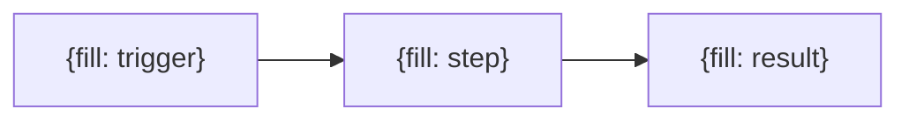
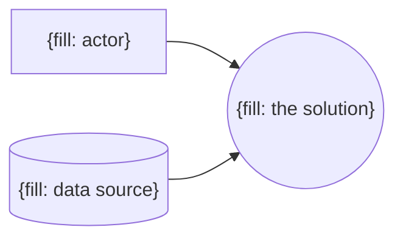

<!-- Tag every claim (said) = the driver said it, or (assumed) = Claude inferred it. Replace each {fill: …}. Mermaid labels stay in double quotes: A["Mail arrives (said)"]. -->

## Original idea

> {fill: the driver's first request, quoted verbatim}

## Actual need

{fill: [actor] needs to [job] so that [outcome]; today blocked by [obstacle]}

## Actors

- Has the problem: {fill: who}
- Pays for the solution: {fill: who}
- Operates it day to day: {fill: who}
- Affected by it: {fill: who}

## As-is process

Pain points: {fill: which steps hurt, and how}

## Cost of the problem

{fill: frequency × time / money / error rate, with confidence low|medium|high}

## Success criteria

| Metric | Baseline | Target |
|---|---|---|
| {fill: metric} | {fill: today, with unit} | {fill: goal, with unit} |

## Context diagram

## Solution mode

Mode: {fill: automate | augment | agent | classic | process-change | dont-build}

{fill: deciding factors — structured input?, judgment needed?, error tolerance, output verifiable?, volume/frequency, data available?, cost per run}

## Constraints and risks

{fill: data protection/GDPR, compliance, budget, who owns it after launch}

## Open questions

- {fill: open question, or "none"}

## Roast

| Cell | Score | Why / fixing question |
|---|---|---|
| Actual need | {fill: 0-2} | {fill: why} |
| Actors | {fill: 0-2} | {fill: why} |
| As-is process | {fill: 0-2} | {fill: why} |
| Cost of the problem | {fill: 0-2} | {fill: why} |
| Success criteria | {fill: 0-2} | {fill: why} |
| Context diagram | {fill: 0-2} | {fill: why} |
| Solution mode | {fill: 0-2} | {fill: why} |
| Constraints and risks | {fill: 0-2} | {fill: why} |

Kill criteria: {fill: none fired, or which}

Verdict: {fill: pass | reroute | kill}

## Solution sketch

{fill: locked until the roast passes}
