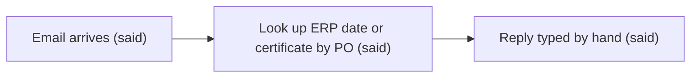
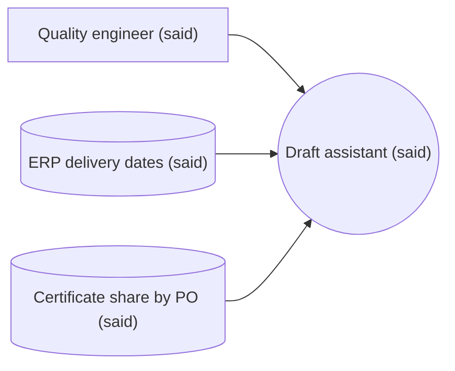

## Original idea

> "We need a ChatGPT bot that answers our supplier emails." (said)

## Actual need

The quality engineer and one colleague need to answer about 40 supplier emails a day (delivery dates, certificate requests) so that suppliers get a correct answer the same day; today blocked by manual lookups in the ERP and the certificate share (said).

## Actors

- Has the problem: quality engineer and one colleague (said)
- Pays for the solution: plant manager (said)
- Operates it day to day: quality engineer (said)
- Affected by it: suppliers (said)

## As-is process

Pain points: the lookups and typing take about 2 h/day across two people (said).

## Cost of the problem

40 emails/day × 3 min = 2 h/day (said). Realistic 1.5–2 h/day, optimistic 2.5 h/day; confidence medium.

## Success criteria

| Metric | Baseline | Target |
|---|---|---|
| Drafts sent without edits (said) | 0% | 80% |
| Wrong date or certificate in a sent reply (said) | 1 per month | 0 per month |
| Handling time per email (said) | 3 min | 1 min |

## Context diagram

## Solution mode

Mode: augment

Free-text emails need reading (judgment); the lookups are structured; a human sends every reply; a wrong answer costs a supplier dispute; 40/day; past emails with sent replies exist in the mailbox.

## Constraints and risks

Supplier emails contain personal data, so the LLM vendor needs a DPA (GDPR). A wrong delivery date sent unchecked causes a supplier dispute; the engineer reviews every draft before sending, so they notice. Owner after launch: the quality engineer.

## Open questions

- none

## Roast

| Cell | Score | Why / fixing question |
|---|---|---|
| Actual need | 2 | specific, said |
| Actors | 2 | all four named, said |
| As-is process | 2 | three steps, said |
| Cost of the problem | 2 | realistic vs optimistic split |
| Success criteria | 2 | three measurable targets |
| Context diagram | 2 | both data sources named |
| Solution mode | 2 | judgment on free text, human reviews |
| Constraints and risks | 2 | says who notices a wrong reply |

Kill criteria: none fired

Verdict: pass

## Solution sketch

Augment: an LLM reads each email, classifies it (delivery date, certificate, other), looks up the ERP date or the certificate by PO, and drafts a reply the engineer approves in the mail client. Classic alternative beaten: keyword rules misrouted about 30% of the driver's sample. About €0.01 per email.
